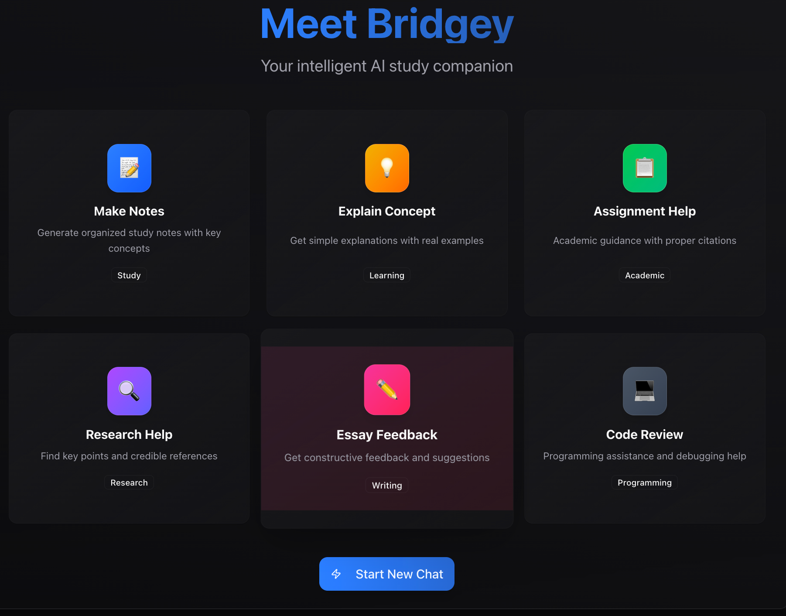

# 🌉 Bridge - Student Networking Platform

<div align="center">
  
  
  **Connecting Students Worldwide Through Technology**
  
  [](https://nextjs.org/)
  [](https://www.typescriptlang.org/)
  [](https://tailwindcss.com/)
  [](https://next-auth.js.org/)
</div>

---

## 📖 Table of Contents

- [🌟 Overview](#-overview)
- [✨ Features](#-features)
- [🚀 Quick Start](#-quick-start)
- [🏗️ Architecture](#️-architecture)
- [📁 Project Structure](#-project-structure)
- [🎨 Design System](#-design-system)
- [🔧 Configuration](#-configuration)
- [📱 Screenshots](#-screenshots)
- [🤝 Contributing](#-contributing)
- [📄 License](#-license)

---

## 🌟 Overview

**Bridge** is a next-generation student networking platform designed to revolutionize how students connect, collaborate, and learn together. Built with modern web technologies, Bridge provides an intuitive and powerful platform for academic networking, study groups, and knowledge sharing.

### 🎯 Mission
To bridge the gap between students worldwide, fostering meaningful connections that enhance academic success and personal growth.

### 🌍 Vision
Creating a global ecosystem where every student has access to collaborative learning opportunities and peer support networks.

---

## ✨ Features

### 🔐 **Authentication & Security**
- **Google OAuth Integration** - Secure sign-in with Google accounts
- **Demo Mode** - Skip authentication for hackathon presentations
- **Session Management** - Persistent user sessions with NextAuth.js
- **Privacy Protection** - GDPR compliant data handling

### 💬 **Communication & Networking**
- **AI-Powered Chat** - Intelligent messaging with context-aware responses
- **Study Groups** - Create and join subject-specific study groups
- **Global Connect** - Network with international students
- **Real-time Messaging** - Instant communication capabilities

### 🤖 **AI Integration**
- **AI Bots Assistant** - Personalized academic support
- **Smart Matching** - AI-driven student pairing algorithms
- **Content Recommendations** - Personalized learning suggestions
- **Language Translation** - Real-time message translation

### 📊 **Academic Tools**
- **Discussion Forums** - Subject-specific discussion boards
- **Resource Sharing** - Document and link sharing capabilities
- **Achievement System** - Gamified learning with leaderboards
- **Progress Tracking** - Academic milestone monitoring

### 🎨 **User Experience**
- **Modern Dark Theme** - Eye-friendly interface design
- **Responsive Design** - Optimized for all device sizes
- **Interactive Animations** - Smooth, engaging user interactions
- **Accessibility** - WCAG 2.1 compliant interface

---

## 🚀 Quick Start

### Prerequisites

Ensure you have the following installed:
- **Node.js** (v18.0.0 or higher)
- **npm** or **yarn** package manager
- **Git** for version control

### Installation

1. **Clone the repository**
   ```bash
   git clone https://github.com/your-username/bridge-platform.git
   cd bridge-platform
   ```

2. **Install dependencies**
   ```bash
   npm install
   # or
   yarn install
   ```

3. **Environment setup**
   ```bash
   cp .env.example .env.local
   ```
   
   Configure your environment variables:
   ```env
   # NextAuth.js Configuration
   NEXTAUTH_URL=http://localhost:3000
   NEXTAUTH_SECRET=your-secret-key
   
   # Google OAuth Credentials
   GOOGLE_CLIENT_ID=your-google-client-id
   GOOGLE_CLIENT_SECRET=your-google-client-secret
   
   # Database Configuration (if applicable)
   DATABASE_URL=your-database-url
   ```

4. **Start development server**
   ```bash
   npm run dev
   # or
   yarn dev
   ```

5. **Open your browser**
   Navigate to [http://localhost:3000](http://localhost:3000)

### 🎉 You're Ready!
The application should now be running locally with full functionality.

---

## 🏗️ Architecture

### Technology Stack

#### **Frontend**
- **Next.js 15.3.1** - React framework with App Router
- **TypeScript** - Type-safe JavaScript development
- **Tailwind CSS** - Utility-first CSS framework
- **shadcn/ui** - Modern component library
- **Lucide React** - Beautiful icon library

#### **Authentication**
- **NextAuth.js** - Complete authentication solution
- **Google OAuth** - Secure social authentication
- **JWT Tokens** - Stateless session management

#### **State Management**
- **React Hooks** - Built-in state management
- **Context API** - Global state sharing
- **Local Storage** - Client-side persistence

#### **Development Tools**
- **ESLint** - Code linting and formatting
- **Prettier** - Code formatting
- **TypeScript** - Static type checking
- **Turbopack** - Fast development bundler

### 🔄 Data Flow


---

## 📁 Project Structure

```
bridge-platform/
├── 📁 app/                          # Next.js App Router
│   ├── 📁 (bridge)/                 # Protected routes group
│   │   ├── 📁 chat/                 # Chat functionality
│   │   ├── 📁 connect/              # Student networking
│   │   ├── 📁 discussions/          # Forum discussions
│   │   ├── 📁 dashboard/            # Main dashboard
│   │   └── 📁 login/                # Authentication page
│   ├── 📁 api/                      # API routes
│   │   ├── 📁 auth/                 # NextAuth.js configuration
│   │   └── 📁 gemini/               # AI integration
│   ├── 📄 layout.tsx                # Root layout component
│   ├── 📄 page.tsx                  # Landing page
│   └── 📄 globals.css               # Global styles
├── 📁 components/                   # Reusable components
│   ├── 📁 ui/                       # shadcn/ui components
│   ├── 📄 login-form.tsx            # Authentication form
│   ├── 📄 app-sidebar.tsx           # Navigation sidebar
│   └── 📄 section-cards.tsx         # Dashboard cards
├── 📁 lib/                          # Utility libraries
│   ├── 📄 auth.ts                   # Authentication config
│   └── 📄 utils.ts                  # Helper functions
├── 📁 public/                       # Static assets
│   └── 📁 images/                   # Application images
├── 📁 hooks/                        # Custom React hooks
├── 📄 middleware.ts                 # Next.js middleware
├── 📄 package.json                  # Dependencies
├── 📄 tailwind.config.js            # Tailwind configuration
├── 📄 tsconfig.json                 # TypeScript configuration
└── 📄 README.md                     # Project documentation
```

---

## 🎨 Design System

### Color Palette

#### **Primary Colors**
- **Cyan**: `#06b6d4` - Primary brand color
- **Purple**: `#8b5cf6` - Secondary brand color
- **Pink**: `#ec4899` - Accent color

#### **Background Colors**
- **Slate-950**: `#020617` - Primary background
- **Purple-950**: `#581c87` - Secondary background
- **Gray variants**: For text and borders

#### **Semantic Colors**
- **Success**: `#10b981` (Emerald)
- **Warning**: `#f59e0b` (Amber)
- **Error**: `#ef4444` (Red)
- **Info**: `#3b82f6` (Blue)

### Typography

#### **Font Stack**
- **Primary**: `Inter, system-ui, sans-serif`
- **Monospace**: `'Fira Code', monospace`

#### **Font Sizes**
- **Headings**: `text-5xl` to `text-8xl`
- **Body**: `text-base` to `text-xl`
- **Small**: `text-sm` to `text-xs`

### Components

#### **Buttons**
- **Primary**: Gradient backgrounds with hover effects
- **Secondary**: Outline style with hover states
- **Ghost**: Transparent with subtle hover effects

#### **Cards**
- **Glass-morphism**: Backdrop blur with transparency
- **Hover Effects**: Scale and glow transformations
- **Gradient Borders**: Dynamic color transitions

---

## 🔧 Configuration

### Environment Variables

Create a `.env.local` file with the following variables:

```env
# Application Configuration
NEXTAUTH_URL=http://localhost:3000
NEXTAUTH_SECRET=your-nextauth-secret

# Google OAuth Configuration
GOOGLE_CLIENT_ID=your-google-client-id
GOOGLE_CLIENT_SECRET=your-google-client-secret

# Database Configuration (Optional)
DATABASE_URL=your-database-connection-string

# AI Integration (Optional)
GEMINI_API_KEY=your-gemini-api-key
```

### Google OAuth Setup

1. **Create Google Cloud Project**
   - Visit [Google Cloud Console](https://console.cloud.google.com/)
   - Create a new project or select existing one

2. **Enable Google+ API**
   - Navigate to "APIs & Services" > "Library"
   - Search for "Google+ API" and enable it

3. **Create OAuth Credentials**
   - Go to "APIs & Services" > "Credentials"
   - Click "Create Credentials" > "OAuth 2.0 Client IDs"
   - Set application type to "Web application"
   - Add authorized redirect URIs:
     - `http://localhost:3000/api/auth/callback/google`
     - `https://yourdomain.com/api/auth/callback/google`

4. **Configure Environment Variables**
   - Copy Client ID and Client Secret to `.env.local`

---

## 📱 Screenshots

### 🏠 Landing Page

*Modern dark theme with interactive animations and feature showcase*

### 💬 Chat Interface

*AI-powered messaging with real-time communication*

### 🤖 AI Bots

*Intelligent AI assistants for academic support*

### 🏆 Leaderboard

*Gamified achievement system with progress tracking*

### 🔗 Networking

*Global student connection platform*

### 📧 Communication

*Integrated messaging and notification system*

---

## 🤝 Contributing

We welcome contributions from the community! Here's how you can help:

### Development Workflow

1. **Fork the repository**
   ```bash
   git fork https://github.com/your-username/bridge-platform.git
   ```

2. **Create a feature branch**
   ```bash
   git checkout -b feature/amazing-feature
   ```

3. **Make your changes**
   - Follow the existing code style
   - Add comments for complex logic
   - Write tests for new features

4. **Commit your changes**
   ```bash
   git commit -m "feat: add amazing feature"
   ```

5. **Push to your branch**
   ```bash
   git push origin feature/amazing-feature
   ```

6. **Open a Pull Request**
   - Provide a clear description of changes
   - Include screenshots for UI changes
   - Reference any related issues

### Code Style Guidelines

- **TypeScript**: Use strict typing
- **Components**: Follow functional component patterns
- **Naming**: Use descriptive, camelCase names
- **Comments**: Document complex logic and APIs
- **Formatting**: Use Prettier for consistent formatting

### Commit Convention

We follow [Conventional Commits](https://www.conventionalcommits.org/):

- `feat:` - New features
- `fix:` - Bug fixes
- `docs:` - Documentation updates
- `style:` - Code style changes
- `refactor:` - Code refactoring
- `test:` - Test additions/updates
- `chore:` - Maintenance tasks

---

## 📄 License

This project is licensed under the **MIT License** - see the [LICENSE](LICENSE) file for details.

### MIT License Summary

- ✅ **Commercial use** - Use in commercial projects
- ✅ **Modification** - Modify the source code
- ✅ **Distribution** - Distribute the software
- ✅ **Private use** - Use privately
- ❌ **Liability** - No warranty or liability
- ❌ **Warranty** - No warranty provided

---

## 🙏 Acknowledgments

- **Next.js Team** - For the amazing React framework
- **Vercel** - For hosting and deployment platform
- **shadcn** - For the beautiful UI component library
- **Tailwind CSS** - For the utility-first CSS framework
- **Google** - For OAuth authentication services
- **Open Source Community** - For inspiration and contributions

---

## 📞 Support & Contact

### 🐛 Bug Reports
If you find a bug, please create an issue on GitHub with:
- Clear description of the problem
- Steps to reproduce
- Expected vs actual behavior
- Screenshots (if applicable)

### 💡 Feature Requests
We love new ideas! Submit feature requests with:
- Clear description of the feature
- Use case and benefits
- Mockups or examples (if applicable)

### 📧 Contact
- **Email**: support@bridge-platform.com
- **GitHub**: [Bridge Platform Repository](https://github.com/your-username/bridge-platform)
- **Discord**: [Join our community](https://discord.gg/bridge-platform)

---

<div align="center">
  <p><strong>Made with ❤️ by the Bridge Development Team</strong></p>
  <p><em>Connecting students, one bridge at a time.</em></p>
</div> # bridge
# bridge
# bridge
